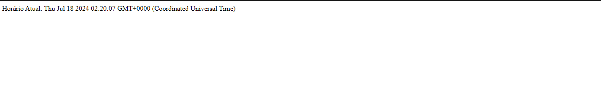

- [O que foi feito?](#o-que-foi-feito)
- [Descrição da Imagem Docker:](#descrição-da-imagem-docker)
- [Imagem de demonstração do relogio](#imagem-de-demonstração-do-relogio)

### O que foi feito?

- Adicionado projeto no Docker

```javascript
"Codigo do Dockerfile"

    FROM node:14

    WORKDIR /app

    COPY package.json ./
    RUN npm install

    COPY . .

    EXPOSE 3000

    CMD ["npm", "start"]
```

```yml
"Codigo do docker-compose"

    services:
      web:
        build: .
        ports:
          - "3000:3000"
        depends_on:
          - db

      db:
        image: mysql:5.7
        environment:
          MYSQL_ROOT_PASSWORD: 1234
          MYSQL_DATABASE: docker
        ports:
          - "3307:3306"
```

### Descrição da Imagem Docker:

> Esta imagem Docker oferece um relógio web funcional, que utiliza um banco de dados MySQL para armazenar e recuperar informações de tempo.

> A imagem é projetada para ser executada em um ambiente containerizado, oferecendo portabilidade e facilidade de implantação.

---

### Imagem de demonstração do relogio


